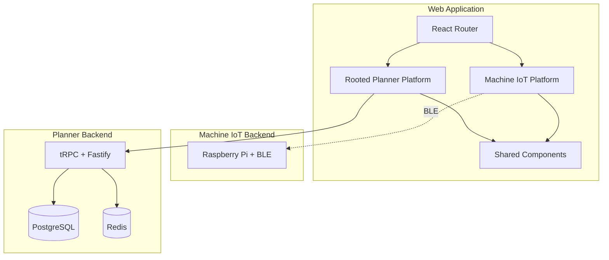

# Rooted Web App

A unified web application hosting two platforms:
1. **Machine IoT** - BLE-based device provisioning for Raspberry Pi machines
2. **Rooted Planner** - Microgreen farm management ERP system

## Project Structure

```
Rooted-Web-App/
├── machines/          # Machine IoT platform (BLE provisioning)
│   ├── src/          # Web frontend (React + Web Bluetooth)
│   └── pi-src/       # Raspberry Pi BLE service (Python)
├── planner/          # Rooted Planner platform (Farm ERP)
│   └── src/          # Farm management features
├── shared/           # Shared components and utilities
└── docs/             # Documentation
```

See [docs/PROJECT_STRUCTURE.md](docs/PROJECT_STRUCTURE.md) for detailed structure.

## Platforms

### Machine IoT
Web-based BLE provisioning for IoT devices. Scan, connect, and configure WiFi on Raspberry Pi machines directly from your browser.

- **Technology**: React + Web Bluetooth API + Python (bluezero)
- **Routes**: `/machines/*`
- **Browser Support**: Chrome, Edge (desktop & Android)

### Rooted Planner
Microgreen farm management application for production workflow management.

- **Technology**: React + tRPC + Fastify + PostgreSQL
- **Routes**: `/planner/*`
- **Authentication**: Clerk

## Architecture



## Setup

```bash
# Clone repository
git clone <repo-url>
cd Rooted-Web-App

# Install dependencies
pnpm install

# Start development
pnpm dev
```

## Documentation

- [Project Structure](docs/PROJECT_STRUCTURE.md) - Detailed file organization
- [Style Guide](docs/STYLE.md) - Code conventions and patterns
- [Agent Guide](docs/AGENT.md) - Development workflow

### Machine IoT
- [Requirements](docs/machine-iot/REQUIREMENTS.md) - Business requirements
- [Architecture](docs/machine-iot/ARCH.md) - Technical design

### Rooted Planner
- [Requirements](docs/rooted-planner/REQUIREMENTS.md) - Business requirements
- [Architecture](docs/rooted-planner/ARCH.md) - Technical design

## Tech Stack

### Frontend (Both Platforms)
- React 18 + TypeScript
- Vite
- TailwindCSS + Shadcn UI
- React Router

### Machine IoT Specific
- Web Bluetooth API
- Zustand (state)
- IndexedDB (persistence)
- Python + bluezero (Raspberry Pi)

### Rooted Planner Specific
- tRPC + React Query
- Fastify (backend)
- Prisma ORM
- PostgreSQL + RLS
- Clerk (auth)
- Redis (cache)

## Contributing

1. Read documentation in `docs/`
2. Create feature branch from `main`
3. Follow style guide and patterns
4. Document session in `docs/agentic-sessions/`
5. Submit pull request
