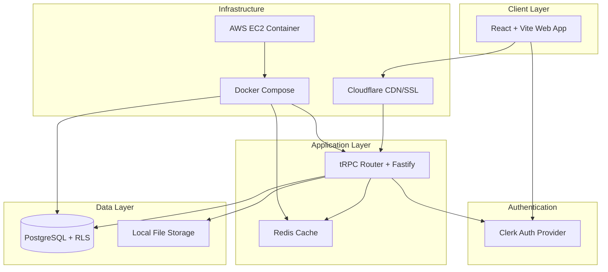

# Rooted Planner

A streamlined microgreen farm management application for single-farm operations. Manage your complete production workflow from order creation to harvest completion.

## Architecture



## Setup

```bash
# Clone repository
git clone <repo-url>
cd rooted-planner-erp

# Install dependencies
pnpm install

# Setup environment
cp .env.example .env.local
# Configure your environment variables

# Start development environment
docker-compose up -d postgres redis
pnpm dev
```

## Contributing

1. Read the documentation in `docs/`:
   - `ARCH.md` - System architecture
   - `STYLE.md` - Coding standards
   - `REQUIREMENTS.md` - Business requirements
   - `AGENT.md` - Development guide

2. Create feature branch from `main`
3. Follow the style guide and patterns
4. Document your session in `docs/agentic-sessions/`
5. Submit pull request

## Tech Stack

- **Frontend**: React + Vite + TailwindCSS + Shadcn
- **Backend**: Fastify + tRPC + Prisma
- **Database**: PostgreSQL with Row-Level Security
- **Auth**: Clerk
- **Cache**: Redis
- **Deployment**: Docker + AWS EC2
