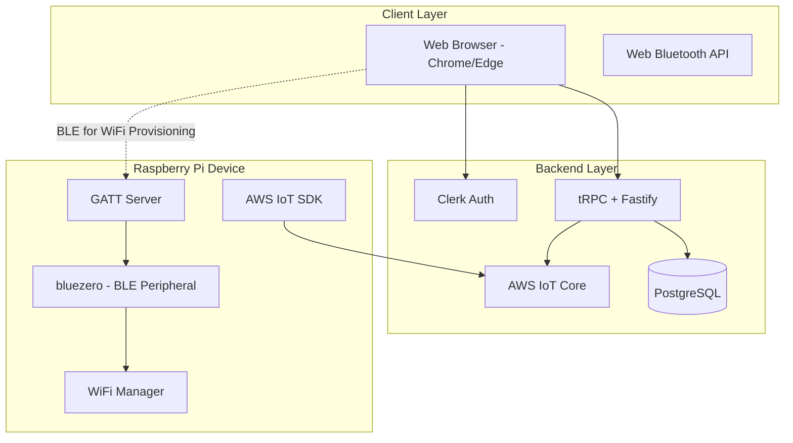
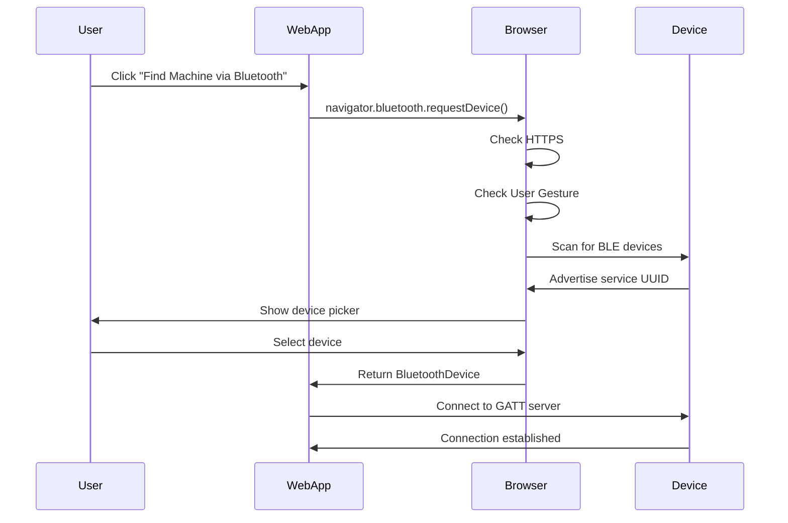
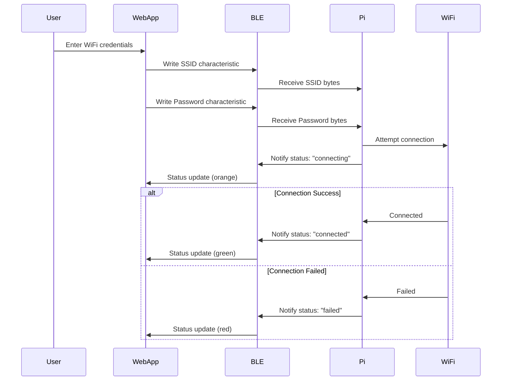

# Architecture Document - Machine IoT

## System Overview

Machine IoT is a web-based BLE provisioning platform that enables users to discover, onboard, and configure WiFi credentials on Raspberry Pi-based IoT devices. The system uses Web Bluetooth API for WiFi provisioning and AWS IoT Core for device management and connectivity monitoring.



## Architecture Style

**Hybrid Architecture with Backend Integration**:
- Backend server for machine management and persistence
- Direct browser-to-device BLE communication for WiFi provisioning only
- AWS IoT Core for device registration and connectivity monitoring
- Multi-tenant database with Clerk authentication
- Shared backend infrastructure with Rooted Planner platform

## Technology Stack

### Frontend (Web Application)
- **React 18** with TypeScript
- **Vite** for build tooling
- **TailwindCSS** + Shadcn UI for styling
- **Web Bluetooth API** for BLE communication (WiFi provisioning only)
- **tRPC Client** + React Query for backend communication
- **Clerk React** for authentication

### Backend (Shared with Rooted Planner)
- **Fastify** with TypeScript
- **tRPC** for type-safe API procedures
- **Prisma ORM** for database operations
- **PostgreSQL** with row-level security
- **Clerk** for authentication and user management
- **AWS IoT Core SDK** for device management

### Device (Raspberry Pi)
- **Python 3.9+**
- **bluezero** library for BLE peripheral/GATT server
- **BlueZ 5.50+** Bluetooth stack
- **NetworkManager** for WiFi configuration
- **AWS IoT Device SDK (Python)** for device registration and heartbeat
- **systemd** for service management

### AWS Services
- **AWS IoT Core** for device registry and connectivity monitoring
- **AWS IoT Device Shadow** for device state management

### Development
- **TypeScript** throughout frontend and backend
- **ESLint** and **Prettier** for code quality

## Web Bluetooth Architecture

### Browser Support Matrix

| Browser | Platform | Support | Notes |
|---------|----------|---------|-------|
| Chrome | Windows 10+ | ✅ Full | Requires Bluetooth 4.0+ adapter |
| Chrome | macOS | ✅ Full | Native support |
| Chrome | Linux | ✅ Full | Requires BlueZ 5.41+ |
| Chrome | Android 6.0+ | ✅ Full | Native support |
| Edge | Windows 10+ | ✅ Full | Chromium-based |
| Edge | macOS | ✅ Full | Chromium-based |
| Firefox | All | ❌ None | No Web Bluetooth support |
| Safari | All | ❌ None | No Web Bluetooth support |
| iOS Browsers | All | ❌ None | WebKit limitation |

### Web Bluetooth Security Model



**Security Requirements:**
1. **HTTPS Only**: Web Bluetooth API only works on secure origins
2. **User Gesture**: Scanning must be triggered by user action (button click)
3. **User Permission**: Browser shows native permission dialog
4. **Service Filtering**: Must specify service UUID filter when scanning

**Note**: BLE connection is ONLY used for WiFi provisioning. All other operations (device management, status checking) go through the backend API.

## BLE GATT Service Design

### Service UUID Structure

```typescript
// Custom service UUID for machine provisioning (from pi-src/provisioner.py)
const MACHINE_SERVICE_UUID = '322486ee-3b18-476d-86ae-2481eafaea9a';

// Characteristic UUIDs
const WIFI_SSID_CHAR_UUID = '322486ee-3b18-476d-86ae-2481eafaea9b';
const WIFI_PASSWORD_CHAR_UUID = '322486ee-3b18-476d-86ae-2481eafaea9c';
const WIFI_STATUS_CHAR_UUID = '322486ee-3b18-476d-86ae-2481eafaea9d';
```

### GATT Characteristics

#### 1. WiFi SSID Characteristic
- **UUID**: `322486ee-3b18-476d-86ae-2481eafaea9b`
- **Properties**: Write
- **Format**: UTF-8 string
- **Purpose**: Receive WiFi network name from browser

#### 2. WiFi Password Characteristic
- **UUID**: `322486ee-3b18-476d-86ae-2481eafaea9c`
- **Properties**: Write
- **Format**: UTF-8 string
- **Purpose**: Receive WiFi password from browser

#### 3. WiFi Status Characteristic
- **UUID**: `322486ee-3b18-476d-86ae-2481eafaea9d`
- **Properties**: Notify
- **Format**: Single byte status code
- **Purpose**: Send connection status updates to browser

**Status Codes:**
- `0x00` - Idle
- `0x01` - Connecting
- `0x02` - Success
- `0x03` - Failure

## Frontend Architecture

### Unified Application Structure

The Machine IoT platform shares the same web application as Rooted Planner, with platform-specific features organized in separate directories:

```
Rooted-Web-App/
├── src/
│   ├── machines/                # Machine IoT Platform
│   │   ├── device-discovery/
│   │   │   ├── components/
│   │   │   │   ├── OnboardMachine.tsx
│   │   │   ├── hooks/
│   │   │   │   └── useOnboardMachine.ts
│   │   ├── wifi-provisioning/
│   │   │   ├── components/
│   │   │   │   └── ChangeWifiModal.tsx
│   │   │   ├── hooks/
│   │   │   │   └── useChangeWifi.ts
│   │   ├── dashboard/
│   │   │   ├── components/
│   │   │   │   ├── MachineCard.tsx
│   │   │   │   └── MachinesList.tsx
│   │   │   ├── hooks/
│   │   │   │   └── useBluetoothScanner.ts
│   │   └── lib/
│   │       ├── bluetooth/
│   │       │   ├── scanner.ts
│   │       │   ├── gatt-client.ts
│   │       │   └── constants.ts
│   ├── planner/                 # Rooted Planner Platform
│   │   ├── products/
│   │   ├── orders/
│   │   ├── tasks/
│   │   ├── customers/
│   │   ├── farm-layout/
│   │   ├── employees/
│   │   └── supplies/
│
├── shared/                      # Shared across both platforms
│   ├── ui/                     # Shared UI components (Shadcn)
│   ├── types/                  # Shared TypeScript types
│   └── api-types/
│
├── apps/api/                    # Backend API (Fastify + tRPC)
│   └── src/
│       ├── domains/
│       │   ├── machine-domain/  # Machine IoT backend
│       │   └── planner-domain/  # Planner backend
│
├── pi-src/                      # Raspberry Pi BLE service
│   ├── provisioner.py
│   └── requirements.txt
│
└── docs/
    ├── machine-iot/
    │   ├── REQUIREMENTS.md
    │   └── ARCH.md
    └── rooted-planner/
        ├── REQUIREMENTS.md
        └── ARCH.md
```

### Platform Routing

The application uses route-based platform separation:

```typescript
// App routing structure
const routes = [
  {
    path: '/machines/*',
    element: <MachinesPlatform />,
    children: [
      { path: 'dashboard', element: <MachinesDashboard /> },
      { path: 'discover', element: <DeviceDiscovery /> },
      { path: 'device/:id', element: <DeviceDetail /> },
    ]
  },
  {
    path: '/planner/*',
    element: <PlannerPlatform />,
    children: [
      { path: 'dashboard', element: <PlannerDashboard /> },
      { path: 'products', element: <Products /> },
      { path: 'orders', element: <Orders /> },
      // ... other planner routes
    ]
  },
  {
    path: '/',
    element: <PlatformSelector />, // Choose between machines or planner
  }
]
```

### State Management

**Unified State Strategy:**
- Both platforms use **tRPC + React Query** for server-side state.
- **Machine IoT** uses local React state (via hooks) for ephemeral BLE operations.
- **Rooted Planner** will use server state for all production data.

**Machine IoT State:**
- **BLE Connections**: Managed via custom hooks in `src/machines/` (e.g., `useOnboardMachine.ts`).
- **Machine Registry**: Fetched from backend via `trpc.machines.list.useQuery()`.
- **No Local Persistence**: Device lists are stored in the database, not in browser storage.

**Planner State:**
- **Server-driven**: All products, orders, and tasks are managed through tRPC procedures and cached by React Query.

### Web Bluetooth Integration

#### Device Discovery Flow

```typescript
// src/lib/bluetooth/scanner.ts
export async function scanForDevices(): Promise<BluetoothDevice> {
  try {
    const device = await navigator.bluetooth.requestDevice({
      filters: [{ services: [MACHINE_SERVICE_UUID] }],
      optionalServices: [MACHINE_SERVICE_UUID]
    });
    return device;
  } catch (error) {
    if (error.name === 'NotFoundError') {
      throw new Error('No devices found');
    }
    throw error;
  }
}
```

#### GATT Connection Flow

```typescript
// src/lib/bluetooth/gatt-client.ts
export class MachineGATTClient {
  private device: BluetoothDevice;
  private server: BluetoothRemoteGATTServer | null = null;
  private service: BluetoothRemoteGATTService | null = null;
  
  async connect(): Promise<void> {
    this.server = await this.device.gatt?.connect();
    this.service = await this.server?.getPrimaryService(MACHINE_SERVICE_UUID);
  }
  
  async writeWiFiCredentials(ssid: string, password: string): Promise<void> {
    const ssidChar = await this.service?.getCharacteristic(WIFI_SSID_CHAR_UUID);
    const passChar = await this.service?.getCharacteristic(WIFI_PASSWORD_CHAR_UUID);
    
    const encoder = new TextEncoder();
    await ssidChar?.writeValue(encoder.encode(ssid));
    await passChar?.writeValue(encoder.encode(password));
  }
  
  async subscribeToStatus(callback: (status: WiFiStatus) => void): Promise<void> {
    const statusChar = await this.service?.getCharacteristic(WIFI_STATUS_CHAR_UUID);
    await statusChar?.startNotifications();
    
    statusChar?.addEventListener('characteristicvaluechanged', (event) => {
      const value = (event.target as BluetoothRemoteGATTCharacteristic).value;
      const decoder = new TextDecoder();
      const status = JSON.parse(decoder.decode(value));
      callback(status);
    });
  }
}
```

## Raspberry Pi Architecture

### Python Service Structure

```
pi-src/
├── provisioner.py                 # Service entry point
└── requirements.txt               # Python dependencies
```

### BLE Peripheral Implementation

```python
# pi-src/provisioner.py
from bluezero import peripheral
from bluezero import adapter

class MachinePeripheral:
    def __init__(self):
        self.adapter = adapter.Adapter()
        self.peripheral = peripheral.Peripheral(
            self.adapter.address,
            local_name='Rooted Machine'
        )
        
    def setup_service(self):
        # Add custom service
        self.service = self.peripheral.add_service(
            srv_id=1,
            uuid=MACHINE_SERVICE_UUID,
            primary=True
        )
        
        # WiFi SSID characteristic (write)
        self.ssid_char = self.service.add_characteristic(
            chrc_id=1,
            uuid=WIFI_SSID_CHAR_UUID,
            value=[],
            notifying=False,
            flags=['write'],
            write_callback=self.on_ssid_write
        )
        
        # WiFi Password characteristic (write)
        self.password_char = self.service.add_characteristic(
            chrc_id=2,
            uuid=WIFI_PASSWORD_CHAR_UUID,
            value=[],
            notifying=False,
            flags=['write'],
            write_callback=self.on_password_write
        )
        
        # WiFi Status characteristic (read, notify)
        self.status_char = self.service.add_characteristic(
            chrc_id=3,
            uuid=WIFI_STATUS_CHAR_UUID,
            value=[],
            notifying=True,
            flags=['read', 'notify'],
            read_callback=self.on_status_read
        )
        
    def on_ssid_write(self, value):
        self.ssid = bytes(value).decode('utf-8')
        
    def on_password_write(self, value):
        self.password = bytes(value).decode('utf-8')
        # Trigger WiFi connection
        self.connect_wifi()
        
    def connect_wifi(self):
        # Update status to "connecting"
        self.update_status('connecting', 'Attempting to connect...')
        
        # Attempt WiFi connection
        success = wifi_manager.connect(self.ssid, self.password)
        
        if success:
            ip = wifi_manager.get_ip_address()
            self.update_status('connected', f'Connected with IP {ip}', ip)
        else:
            self.update_status('failed', 'Invalid credentials or network not found')
```

### WiFi Management

```python
# pi-src/provisioner.py (WiFi manager functions)
import subprocess
import json

class WiFiManager:
    def connect(self, ssid: str, password: str) -> bool:
        """Connect to WiFi network using NetworkManager"""
        try:
            # Using nmcli for NetworkManager
            cmd = [
                'nmcli', 'device', 'wifi', 'connect',
                ssid, 'password', password
            ]
            result = subprocess.run(cmd, capture_output=True, timeout=30)
            return result.returncode == 0
        except Exception as e:
            print(f"WiFi connection failed: {e}")
            return False
            
    def get_ip_address(self) -> str:
        """Get current IP address"""
        try:
            result = subprocess.run(
                ['hostname', '-I'],
                capture_output=True,
                text=True
            )
            return result.stdout.strip().split()[0]
        except:
            return None
```

### Systemd Service

```ini
# /etc/systemd/system/rooted-ble.service
[Unit]
Description=Rooted Robotics BLE Provisioner
After=bluetooth.target network.target

[Service]
Type=simple
User=root
WorkingDirectory=/opt/rooted-ble
ExecStart=/opt/rooted-ble/ble-wrapper.sh
Restart=no

[Install]
WantedBy=multi-user.target
```

## Data Flow

### WiFi Provisioning Sequence



## Error Handling

### Browser-Side Errors

```typescript
enum BluetoothError {
  NOT_SUPPORTED = 'Browser does not support Web Bluetooth',
  NOT_AVAILABLE = 'Bluetooth adapter not available',
  USER_CANCELLED = 'User cancelled device selection',
  CONNECTION_FAILED = 'Failed to connect to device',
  GATT_ERROR = 'GATT operation failed',
  TIMEOUT = 'Operation timed out'
}
```

### Device-Side Errors

```python
class WiFiError(Enum):
    INVALID_PASSWORD = 'Invalid WiFi password'
    NETWORK_NOT_FOUND = 'WiFi network not found'
    TIMEOUT = 'Connection timeout'
    DHCP_FAILED = 'Failed to obtain IP address'
    UNKNOWN = 'Unknown error occurred'
```

## Security Considerations

### Current Implementation (Development)

- Plain text credential transmission over BLE
- No authentication between browser and device
- Local-only data storage (no cloud sync)
- HTTPS required for Web Bluetooth API

### Future Production Requirements

1. **Credential Encryption**: Implement AES encryption for WiFi credentials
2. **Device Authentication**: Add pairing PIN or certificate-based auth
3. **Secure Storage**: Encrypt stored credentials on Raspberry Pi
4. **Rate Limiting**: Prevent brute force attacks on WiFi provisioning
5. **Audit Logging**: Log all provisioning attempts

## Deployment Architecture

### Web Application Deployment

**Static Hosting Options:**
- Cloudflare Pages
- Vercel
- Netlify
- AWS S3 + CloudFront

**Requirements:**
- HTTPS enabled (mandatory for Web Bluetooth)
- Custom domain support
- CDN for global distribution

### Raspberry Pi Setup

**Initial Configuration:**
Deployment is handled via scripts in `pi-src/`.

```bash
# Deploy BLE service to Raspberry Pi
cd pi-src
./deploy-to-pi-one.sh <pi-ip-address>

# Verify deployment
ssh pi@<pi-ip-address>
sudo systemctl status rooted-ble
sudo journalctl -u rooted-ble -f
```

**BLE Advertising Configuration:**
```bash
# Set device to LE-only mode for better compatibility
sudo btmgmt -i hci0 power off
sudo btmgmt -i hci0 le on
sudo btmgmt -i hci0 bredr off
sudo btmgmt -i hci0 power on
```

## Performance Considerations

### BLE Connection Limits

- **Single Connection**: BLE peripheral can only maintain one active connection
- **Connection Timeout**: 30-second timeout for GATT operations
- **MTU Size**: Default 23 bytes, negotiable up to 512 bytes
- **Notification Rate**: Limit status updates to avoid overwhelming connection

### Browser Limitations

- **Concurrent Connections**: Browser can maintain multiple BLE connections
- **Background Tabs**: Connections may be throttled in background tabs
- **Memory**: IndexedDB storage limited by browser quota (typically 50MB+)

## Testing Strategy

### Frontend Testing

**Unit Tests (Vitest):**
- Bluetooth utility functions
- State management logic
- Data transformation functions

**Integration Tests:**
- Mock Web Bluetooth API
- Test GATT communication flows
- IndexedDB operations

**E2E Tests (Playwright):**
- User flows with mocked BLE devices
- Error handling scenarios
- Browser compatibility checks

### Device Testing

**Python Unit Tests:**
- GATT characteristic handlers
- WiFi manager functions
- Status notification logic

**Integration Tests:**
- Full provisioning flow with test WiFi network
- Error scenarios (invalid credentials, network not found)
- Connection recovery after failures

## Monitoring & Observability

### Frontend Metrics

- Device discovery success rate
- Connection failure reasons
- Provisioning completion rate
- Browser compatibility statistics

### Device Metrics

- BLE connection uptime
- WiFi provisioning success rate
- Error frequency by type
- System resource usage

## Future Enhancements

### Phase 2 Features

1. **Multi-Device Management**: Provision multiple devices simultaneously
2. **Device Groups**: Organize devices by location or function
3. **Firmware Updates**: OTA updates via BLE
4. **Network Diagnostics**: Ping tests, speed tests from device
5. **Advanced WiFi**: Support for enterprise WiFi (WPA2-Enterprise)

### Phase 3 Features

1. **Cloud Sync**: Optional cloud backup of device configurations
2. **Remote Access**: Manage devices from anywhere (requires cloud backend)
3. **Analytics Dashboard**: Usage statistics and health monitoring
4. **Mobile App**: Native iOS/Android apps for broader compatibility

## Alternative Architectures Considered

### Native Mobile App

**Pros:**
- Better BLE support across platforms
- iOS compatibility
- Background operation

**Cons:**
- Requires separate iOS and Android development
- App store approval process
- Higher development and maintenance cost

**Decision**: Web-first approach for faster iteration, consider native apps in Phase 3

### SoftAP Provisioning

**Pros:**
- Works on all browsers
- No BLE dependency

**Cons:**
- Poor user experience (network switching)
- iOS compatibility issues
- Security concerns with open AP

**Decision**: BLE provisioning provides better UX despite browser limitations

This architecture provides a foundation for a simple, secure, and user-friendly IoT device provisioning platform using modern web technologies and standard BLE protocols.
