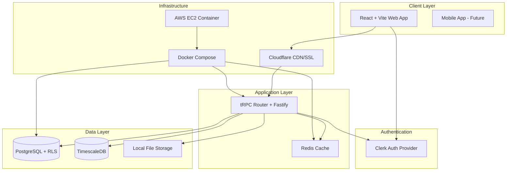
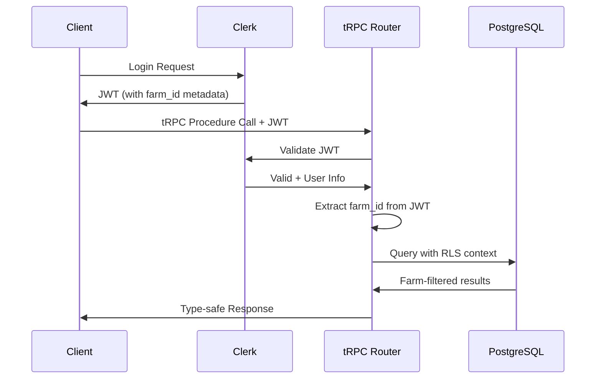
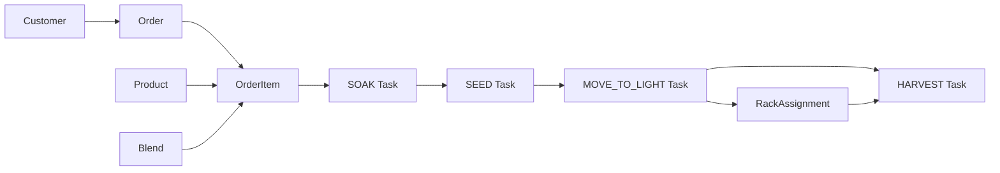
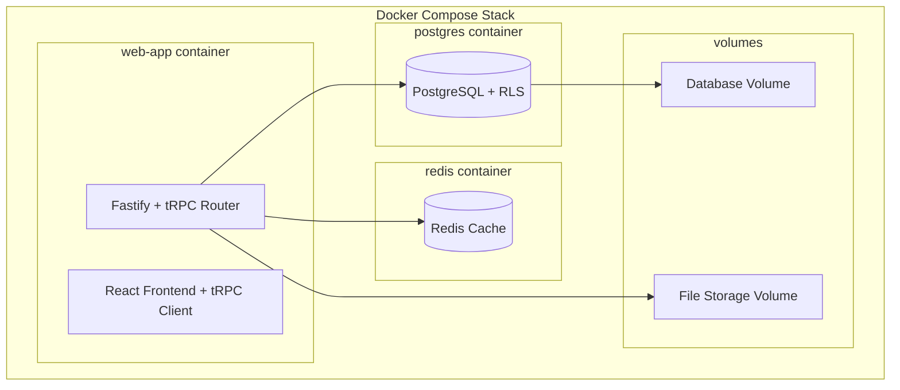

# Architecture Document - Rooted Planner

## System Overview

Rooted Planner is a microgreen farm management application built on a multi-tenant architecture. The system manages the complete production workflow from order creation to harvest completion across multiple farm operations.



## Architecture Style

**Containerized Monolithic Web Application** with multi-tenant data isolation:
- Single deployable unit for operational simplicity
- Docker containers for portability across cloud platforms
- PostgreSQL with row-level security for tenant isolation
- External authentication via Clerk

## Technology Stack

### Frontend
- **React 18** with TypeScript
- **Vite** for build tooling and development
- **TailwindCSS** for styling
- **tRPC Client** with React Query for data fetching
- **Canvas API** for farm layout visualization
- **Clerk React** for authentication

### Backend
- **Fastify** with TypeScript
- **tRPC** for end-to-end type-safe API procedures
- **Prisma ORM** for database operations
- **PostgreSQL** with row-level security
- **TimescaleDB** for time-series telemetry data
- **Redis** for caching and session storage
- **Clerk** for authentication and user management

### Infrastructure
- **Docker** containers with Docker Compose
- **AWS EC2** deployment target
- **Cloudflare** for HTTPS, DDoS protection, SSL termination
- **Local filesystem** for file storage within containers

### Development
- **Turborepo** monorepo structure
- **pnpm** package manager
- **TypeScript** throughout

## Multi-Tenant Architecture

### Tenant Isolation
- **Row-Level Security (RLS)**: Every table includes `farm_id` column with PostgreSQL RLS policies
- **JWT Context**: Farm context embedded in Clerk JWT metadata, extracted by Fastify middleware
- **API Design**: Clean URLs (`/api/products`) with farm context from authenticated user

### Authentication Flow



## API Architecture

### tRPC Integration

**End-to-End Type Safety:**
- **Zod Schemas**: Defined in domain types or `@shared/api-types` as the single source of truth
- **tRPC Procedures**: Type-safe API endpoints with automatic TypeScript inference
- **React Query**: Automatic caching and state management on the frontend
- **Shared Types**: No code generation needed - types flow automatically

### tRPC Router Structure
```typescript
// apps/api/src/router/index.ts
export const appRouter = router({
  products: productRouter,      // Product CRUD and queries
  orders: orderRouter,          // Order management
  tasks: taskRouter,            // Production workflow
  customers: customerRouter,    // CRM operations
  farmLayout: farmLayoutRouter, // Canvas operations
  employees: employeeRouter,    // Team management
  supplies: suppliesRouter,     // Inventory tracking
  settings: settingsRouter,     // Farm configuration
});
```

### Procedure Types
- **Query Procedures**: Data fetching with caching
- **Mutation Procedures**: Create, update, delete operations
- **Subscription Procedures**: Real-time updates (future WebSocket integration)

### React Query Integration
- **Automatic Caching**: tRPC + React Query handles caching automatically
- **Optimistic Updates**: Seamless UI updates for mutations
- **Background Refetching**: Keep data fresh without user intervention
- **Error Handling**: Consistent error states across the application

### User-Farm Mapping
- **Clerk Metadata**: `farm_id` stored in Clerk user metadata
- **Farm Assignment**: Users assigned to farms during signup/onboarding
- **Context Extraction**: tRPC context extracts farm context from validated JWT

## Core Domain Models

### Production Workflow



### Feature-Based Module Organization
```
src/
├── products/          # Microgreen varieties and blends
├── orders/            # Order management and recurring orders
├── tasks/             # Production workflow and task management
├── customers/         # CRM functionality
├── farm-layout/       # Visual farm editor
├── employees/         # Team management
├── supplies/          # Inventory tracking
├── settings/          # Farm configuration
└── shared/            # Common utilities and types
```

### Key Entities (All with farm_id)
- **Product**: Microgreen varieties with production timing
- **Blend**: Composite products from multiple varieties
- **Customer**: CRM for wholesale/retail customers
- **Order/OrderItem**: Order management with auto-task generation
- **Task**: Production workflow steps with completion tracking
- **RackAssignment**: Track what's growing where
- **RecurringOrder**: Automated regular customer orders
- **Employee**: Team management
- **Supply**: Inventory tracking for seeds and materials
- **FarmLayout**: Visual farm/grow room representation

## Data Flow & State Management

### Order-to-Production Flow
1. **Order Creation**: Customer order with target harvest dates
2. **Task Generation**: Auto-calculate soak/seed/light dates based on product timing
3. **Task Execution**: Database-driven state transitions (TODO → IN_PROGRESS → COMPLETED)
4. **Rack Assignment**: Track tray locations during grow phase
5. **Harvest Completion**: Record actual yields and completion

### Task State Management
- **Database-Driven**: Task states managed through database updates
- **User-Controlled**: State transitions primarily triggered by user actions
- **Validation**: Business rules enforced at application layer

**Note**: Task workflow automation and advanced state machine patterns are intentionally left flexible for future enhancement based on operational requirements.

### Recurring Orders
- **Cron Job**: Simple in-application scheduler for order generation
- **Lead Time**: Configurable advance scheduling based on production timing
- **Auto-Generation**: Creates orders and associated tasks automatically

## User Interface Architecture

### Navigation Structure
```
Dashboard
├── Products (varieties, categories, blends)
├── Planning (orders, recurring orders)
├── Operations (calendar, seeding, transplant, harvest views)
├── Farm Layout (visual editor)
├── Customers
├── Employees
├── Supplies
└── Settings
```

### Specialized Views
- **Calendar View**: Timeline of all tasks
- **Seeding View**: Focus on planting tasks
- **Transplant View**: Moving trays to grow lights
- **Harvest View**: Ready-to-harvest items
- **Farm Layout**: Canvas-based visual editor (frontend-only rendering, JSON backend storage)

## Database Design

### Multi-Tenant PostgreSQL
- **Row-Level Security**: Automatic farm_id filtering on all tenant data
- **Shared Reference Data**: Global lookup tables where appropriate
- **Performance**: Proper indexing on farm_id columns
- **Backup Strategy**: Standard PostgreSQL backup procedures

### Core Database Schema

#### Farm & User Management
```sql
-- Core tenant table
farms (
  id              UUID PRIMARY KEY,
  name            VARCHAR NOT NULL,
  slug            VARCHAR UNIQUE NOT NULL,
  logo_url        VARCHAR,
  brand_color     VARCHAR,
  contact_email   VARCHAR,
  contact_phone   VARCHAR,
  address         JSONB,
  settings        JSONB,
  created_at      TIMESTAMP DEFAULT NOW(),
  updated_at      TIMESTAMP DEFAULT NOW()
);

-- User-farm relationship
farm_users (
  id              UUID PRIMARY KEY,
  farm_id         UUID REFERENCES farms(id),
  clerk_user_id   VARCHAR UNIQUE NOT NULL,
  role            VARCHAR NOT NULL, -- OWNER, ADMIN, FARM_MANAGER, FARM_OPERATOR
  first_name      VARCHAR,
  last_name       VARCHAR,
  email           VARCHAR,
  is_active       BOOLEAN DEFAULT true,
  created_at      TIMESTAMP DEFAULT NOW()
);
```

#### Products & Production
```sql
-- Product categories
product_categories (
  id              UUID PRIMARY KEY,
  farm_id         UUID REFERENCES farms(id),
  name            VARCHAR NOT NULL,
  description     TEXT,
  created_at      TIMESTAMP DEFAULT NOW()
);

-- Microgreen varieties
products (
  id                  UUID PRIMARY KEY,
  farm_id             UUID REFERENCES farms(id),
  category_id         UUID REFERENCES product_categories(id),
  name                VARCHAR NOT NULL,
  sku                 VARCHAR,
  days_soaking        INTEGER NOT NULL,
  days_germination    INTEGER NOT NULL,
  days_light          INTEGER NOT NULL,
  avg_yield_per_tray  DECIMAL(8,2),
  seed_weight         DECIMAL(8,2),
  seed_unit           VARCHAR,
  unit_cost           DECIMAL(10,2),
  unit_price          DECIMAL(10,2),
  is_active           BOOLEAN DEFAULT true,
  created_at          TIMESTAMP DEFAULT NOW()
);

-- Product blends/mixes
blends (
  id              UUID PRIMARY KEY,
  farm_id         UUID REFERENCES farms(id),
  name            VARCHAR NOT NULL,
  description     TEXT,
  created_at      TIMESTAMP DEFAULT NOW()
);

blend_ingredients (
  id              UUID PRIMARY KEY,
  blend_id        UUID REFERENCES blends(id),
  product_id      UUID REFERENCES products(id),
  percentage      DECIMAL(5,2) NOT NULL, -- 0.00 to 100.00
  timing_override JSONB -- Optional timing overrides
);
```

#### Orders & Tasks
```sql
-- Customer management
customers (
  id              UUID PRIMARY KEY,
  farm_id         UUID REFERENCES farms(id),
  name            VARCHAR NOT NULL,
  email           VARCHAR,
  phone           VARCHAR,
  company_name    VARCHAR,
  customer_type   VARCHAR, -- Retail, Wholesale, Restaurant, etc.
  payment_terms   VARCHAR, -- Due on Receipt, Net 7/15/30/60
  address         JSONB,
  tags            TEXT[],
  notes           TEXT,
  is_active       BOOLEAN DEFAULT true,
  created_at      TIMESTAMP DEFAULT NOW()
);

-- Orders
orders (
  id              UUID PRIMARY KEY,
  farm_id         UUID REFERENCES farms(id),
  customer_id     UUID REFERENCES customers(id),
  order_number    VARCHAR UNIQUE NOT NULL,
  status          VARCHAR NOT NULL, -- Pending, In Progress, Ready, Delivered, Cancelled
  notes           TEXT,
  created_at      TIMESTAMP DEFAULT NOW(),
  updated_at      TIMESTAMP DEFAULT NOW()
);

order_items (
  id              UUID PRIMARY KEY,
  order_id        UUID REFERENCES orders(id),
  product_id      UUID REFERENCES products(id),
  blend_id        UUID REFERENCES blends(id),
  quantity_oz     DECIMAL(8,2) NOT NULL,
  harvest_date    DATE NOT NULL,
  overage_percent DECIMAL(5,2) DEFAULT 10.00,
  trays_needed    INTEGER,
  soak_date       DATE,
  seed_date       DATE,
  move_to_light_date DATE,
  created_at      TIMESTAMP DEFAULT NOW()
);

-- Production tasks
tasks (
  id              UUID PRIMARY KEY,
  farm_id         UUID REFERENCES farms(id),
  order_item_id   UUID REFERENCES order_items(id),
  title           VARCHAR NOT NULL,
  type            VARCHAR NOT NULL, -- SOAK, SEED, MOVE_TO_LIGHT, HARVEST
  due_date        DATE NOT NULL,
  status          VARCHAR DEFAULT 'TODO', -- TODO, IN_PROGRESS, COMPLETED, CANCELLED
  priority        VARCHAR DEFAULT 'MEDIUM',
  completed_at    TIMESTAMP,
  completed_by    VARCHAR,
  completion_notes TEXT,
  actual_trays    INTEGER,
  seed_lot        VARCHAR,
  created_at      TIMESTAMP DEFAULT NOW()
);
```

#### Farm Layout & Operations
```sql
-- Farm layout visualization
farm_layouts (
  id              UUID PRIMARY KEY,
  farm_id         UUID REFERENCES farms(id),
  name            VARCHAR NOT NULL,
  canvas_data     JSONB NOT NULL, -- Canvas dimensions, elements, etc.
  is_active       BOOLEAN DEFAULT true,
  created_at      TIMESTAMP DEFAULT NOW()
);

-- Rack assignments for tracking
rack_assignments (
  id              UUID PRIMARY KEY,
  farm_id         UUID REFERENCES farms(id),
  rack_element_id VARCHAR NOT NULL, -- Reference to layout element
  level           INTEGER NOT NULL,
  order_item_id   UUID REFERENCES order_items(id),
  tray_count      INTEGER NOT NULL,
  assigned_at     TIMESTAMP DEFAULT NOW(),
  assigned_by     VARCHAR,
  is_active       BOOLEAN DEFAULT true,
  removed_at      TIMESTAMP
);

-- Recurring order schedules
recurring_order_schedules (
  id              UUID PRIMARY KEY,
  farm_id         UUID REFERENCES farms(id),
  customer_id     UUID REFERENCES customers(id),
  name            VARCHAR NOT NULL,
  schedule_type   VARCHAR NOT NULL, -- FIXED_DAY, INTERVAL
  days_of_week    INTEGER[], -- For FIXED_DAY: [1,3,5] = Mon,Wed,Fri
  interval_days   INTEGER, -- For INTERVAL: every N days
  start_date      DATE NOT NULL,
  end_date        DATE,
  lead_time_days  INTEGER DEFAULT 7,
  is_active       BOOLEAN DEFAULT true,
  created_at      TIMESTAMP DEFAULT NOW()
);
```

### Key Relationships
- Products → OrderItems (what to grow)
- OrderItems → Tasks (production steps)
- Tasks → RackAssignments (where it's growing)
- RecurringOrders → Orders (automated generation)
- Blends → Products (composite ingredients)

## Caching & Performance

### Redis Integration
- **Session Caching**: User session and authentication state
- **Query Caching**: Frequently accessed farm data
- **Task Queues**: Background job processing for recurring orders

### Performance Considerations
- **Database Indexing**: Optimized for farm_id filtering
- **Connection Pooling**: Efficient database connection management
- **Query Optimization**: Prisma query optimization and monitoring

## Security Architecture

### Authentication & Authorization
- **Clerk Integration**: External authentication provider
- **JWT Validation**: Fastify middleware validates all requests
- **Role-Based Access**: User roles (OWNER, ADMIN, FARM_MANAGER, FARM_OPERATOR)
- **Tenant Isolation**: Automatic farm_id filtering prevents cross-tenant access

### Data Protection
- **HTTPS Enforcement**: Cloudflare SSL termination
- **Input Validation**: Comprehensive request validation
- **SQL Injection Prevention**: Prisma ORM parameterized queries
- **CORS Configuration**: Restricted to authorized origins

### Infrastructure Security
- **Container Security**: Minimal base images, non-root users
- **Network Security**: Cloudflare DDoS protection
- **Secrets Management**: Environment variables for all sensitive data

## Deployment Architecture

### Containerization



### Production Deployment
- **AWS EC2**: Single instance deployment
- **Docker Compose**: Container orchestration
- **Cloudflare**: CDN, SSL, DDoS protection
- **Volume Persistence**: Database and file storage

### File Storage
- **Local Filesystem**: Files stored within container volumes
- **Farm Assets**: Logos, layout images stored locally
- **Backup Strategy**: Volume backup as part of overall backup plan

## Monitoring & Observability

### Logging Strategy
- **Structured Logging**: JSON format with farm_id context
- **Simplicity Focus**: Essential logging without over-engineering
- **Error Tracking**: Comprehensive error logging and alerting
- **Performance Metrics**: Basic application performance monitoring

### Business Metrics
- **Production Analytics**: Task completion rates, yield tracking
- **Order Fulfillment**: Customer order metrics
- **Farm Efficiency**: Resource utilization and productivity

## Scalability Considerations

### Current Architecture Limits
- **Single Instance**: Suitable for initial scale (~50 users, $100/month)
- **Vertical Scaling**: EC2 instance size increases
- **Database Performance**: PostgreSQL optimization and connection pooling

### Future Scaling Options
- **Horizontal Scaling**: Load balancer + multiple app instances
- **Database Scaling**: Read replicas, connection pooling
- **Microservices**: Extract high-traffic domains if needed
- **Cloud Services**: Migration to managed services (RDS, ElastiCache)

## Development Workflow

### Project Structure
```
├── apps/
│   └── api/                # Fastify Backend (The "Provider")
├── src/                    # React + Vite Frontend (The "Consumer")
│   ├── planner/            # Rooted Planner platform
│   ├── machines/           # Machine IoT platform
│   └── admin/              # Admin portal
├── shared/                 # Shared code (Types, UI components)
├── docker/                 # Global orchestration
└── package.json            # Root configuration
```

### Code Organization
- **Feature-Based Modules**: Domain-driven folder structure within `apps/api/src/domains/` and `src/`
- **Shared Logic**: Zod schemas and business rules in domain types or `shared/`
- **UI Components**: Reusable components in `shared/ui/`
- **Database**: Single source of truth Prisma schema in `apps/api/prisma/`
- **Type Safety**: End-to-end types from tRPC procedures to React components

## Integration Points

### External Services
- **Clerk**: Authentication and user management
- **Cloudflare**: CDN, SSL, security
- **AWS**: Infrastructure hosting

### Future Integrations
- **Email Notifications**: Order and task notifications
- **SMS Alerts**: Critical task reminders
- **Accounting Systems**: Financial data export
- **IoT Sensors**: Environmental monitoring integration

## Questions & Future Considerations

### Task Workflow Evolution
- **Advanced Automation**: Workflow engines for complex task dependencies
- **Real-time Updates**: WebSocket integration for live task status
- **Mobile App**: Task completion via mobile devices
- **IoT Integration**: Sensor-driven task triggers

### Scaling Decisions
- **Multi-Region**: Geographic distribution for larger customer base
- **Microservices**: When to extract specific domains
- **Managed Services**: Migration timeline for AWS managed services
- **Performance Optimization**: Caching strategies and database optimization

### Business Logic Extensions
- **Advanced Analytics**: Predictive modeling for production planning
- **Supply Chain**: Vendor management and procurement automation
- **Quality Control**: Batch tracking and compliance reporting
- **Financial Integration**: Automated invoicing and payment processing
